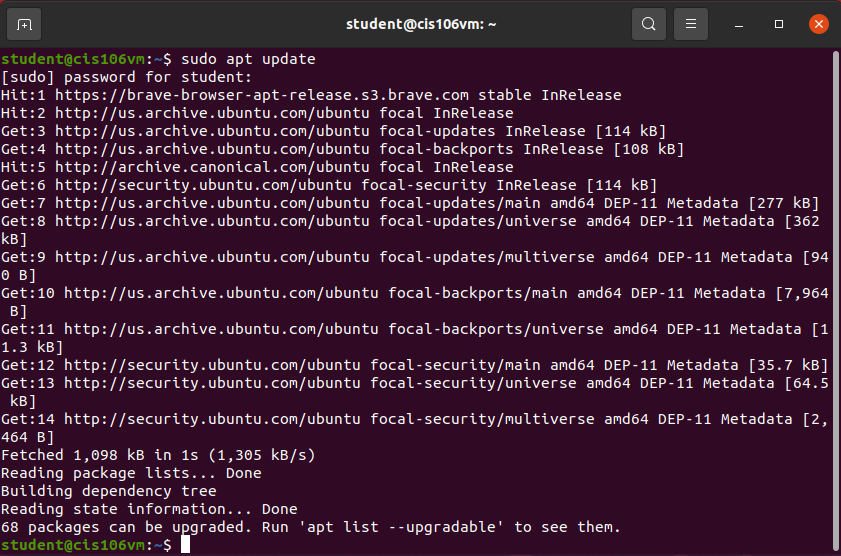
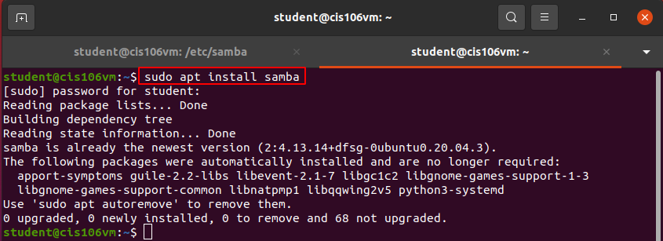
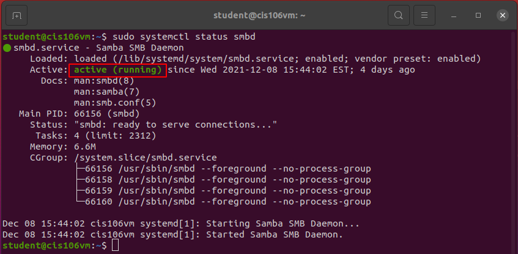
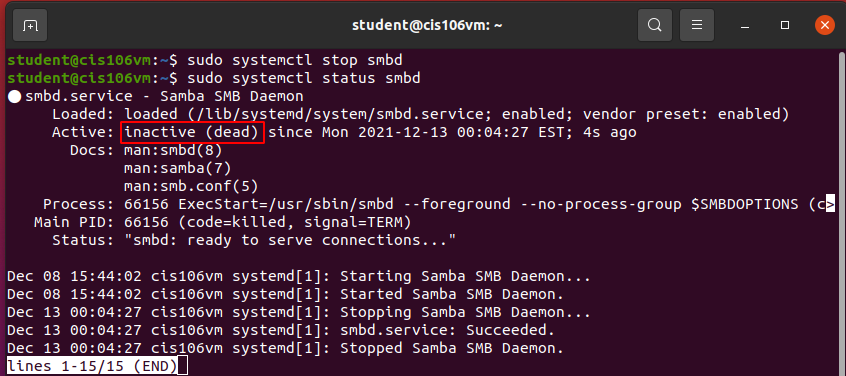
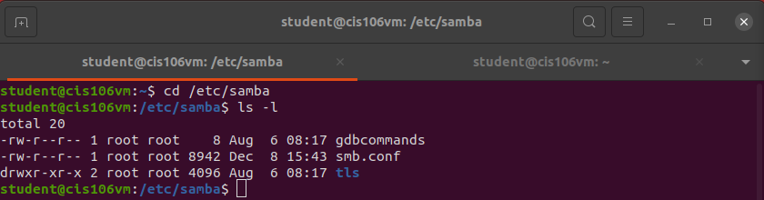
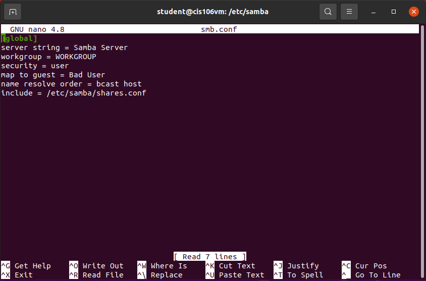
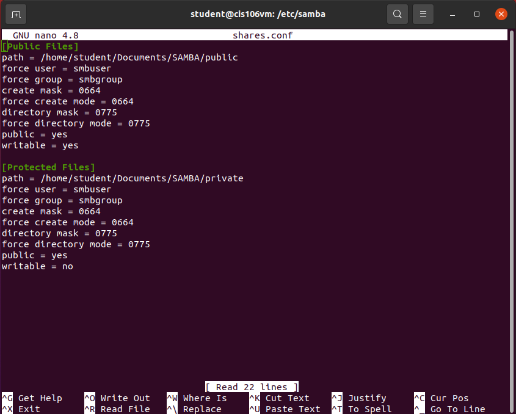
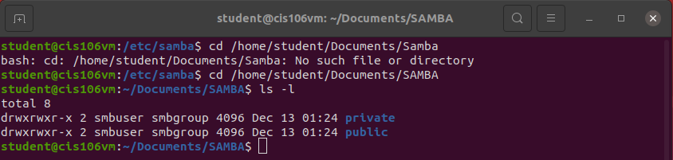
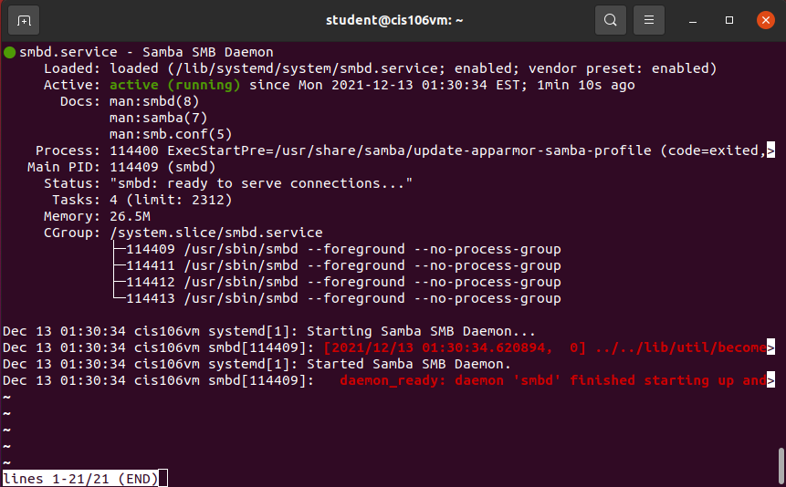
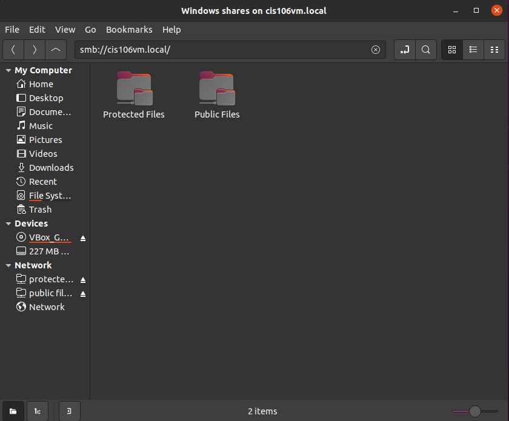

### Mark A. Gaela
### Professor Alberto
### CIS-106-ME1: Linux Fundamentals
### 16 December 2021

# Building a File Server: SAMBA File Server

## Table of Contents
<!-- vscode-markdown-toc -->
* 1. [Installing SAMBA](#Installing)
* 2. [Checking the status of SAMBA](#Checking)
* 3. [Configuring the SAMBA config file](#Configurating)
* 4. [Create the SAMBA user and group](#Create)
* 5. [Set up the folder permissions](#Set)
* 6. [Starting/Restarting SAMBA](#Starting/)
* 7. [Work Cited](#Work)
<!-- vscode-markdown-toc-config
	numbering=true
	autoSave=true
	/vscode-markdown-toc-config -->
<!-- /vscode-markdown-toc -->

##  1. Installing SAMBA

1. Open your Linux terminal.
2. Enter
   >sudo apt update
   
   This will update your repository to check for any changes.

   **sudo** - super user do
   **apt** - task to install,remove,update software
   **update** - command for apt to update software

3. Enter
   >sudo apt install samba

   This will install the application samba.

   **install** - command for apt to install software
   **samba** - installing SAMBA software from the repository

*SAMBA was preinstalled for me already.*

##  2. Checking the status of SAMBA

1. Enter
   >sudo systemctl status smbd

   This will check if your Samba server is active or running.

   **systemctl** - command to control the system manager.
   **status** - show the runtime status of a unit
   **smbd** - the software unit being selected.

2. Enter
   >sudo systemctl stop smbd

   This will stop the Samba server. We will configure the Samba server while it is down then restart it once we are done.

   **stop** - command to stop a piece of software
   **smbd** - the Samba SMB Daemon software

##  3. Configuring the SAMBA config file

SAMBA has made a new directory in the etc directory. Your SAMBA server should also be inactive or dead.

1. Back Up the conf. file by entering this command while in the **etc/samba directory**.
   >sudo mv smb.conf smb.conf.bak

   This will rename the extension of the smb.conf file to a smb.conf.bak file. 
   **mv** - command to move files or directories. This can also rename files.

2. Create a new smb.conf file with this command
   >sudo nano smb.conf
   
   This will make a new smb.conf file and it will be opened with the program nano.
   **nano** - text editor

3. Set up the smb.conf file in this way.
   
   >[global]
   server string = Samba Server
   workgroup = WORKGROUP
   security = user
   map to guest = Bad User
   name resolve order = bcast host
   include = /etc/samba/shares.conf

    **[global]** is the header section of config options.
    **server string** is the name of the server
    **workgroup** is the workgroup that can access it. WORKGROUP is default.
    **security** is who can access it.
    **map to guest** will let it not allow a user account to access the server.
    **name resolve order** will check the host in a specific order.
    **include** will access other configuration files to implement. Useful for organization.

4. Create the directories that will be shared
   Enter
   >mkdir -p /home/student/Documents/SAMBA/{public,private}

   **mkdir** will make a directory
   **p** argument will allow the creation the parent directories
   **{public,private}** will create two folders respectively in the SAMBA folder.

5. Create the shares.conf file
   This file will deal with what directories are accessible and what permission will be allowed. Enter
   >sudo nano shares.conf

   In the file, the structure will be
   >[Public Files]
   path = /home/student/Documents/SAMBA/public
   force user = smbuser
   force group = smbgroup
   create mask = 0664
   force create mode = 0664
   directory mask = 0775

   **[Public Files]** is the header section of the config optinos for publicly accessible files.
   **path** is the directory that will be accessed.
   **force user** is the user being used to access the server.
   **force group** is the group being used to access the server.
   **create mask** is the permissions of a file when it is created.
   -6-- user has rw- permissions
   --6- group has rw- permissions
   ---4 other has r-- permissions
   **force create mode** is the permissions required when creating a file.
   **directory mask** is the permissions of the directory when it is created.
   -7-- user has rwx permissions
   --7- group has rwx permissions
   ---5 other has r-x permissions. *Execute permission is to allow the user to go inside the directory*
   **force directory mode** forces the permissions of created directory
   **public** makes the directory public
   **writable** allows changes

6. Optional: Make another directory but for files that can be download files but not be able to change the files. 
   
   To this this, you can create a new section and type with the following changes.
   >[Protected Files]
   path = /home/student/Documents/SAMBA/private
   writable = no

   **path** will be a different path for protected files
   **writable** will not allow users to change files and only download them

   

##  4. Create the SAMBA user and group

1. Create the group by entering
   >sudo groupadd --system smbgroup
  
   **groupadd** - create a new group.
   **--system** - within the system
   **smbgroup** - name of the group

    *You can check if the group was recently made with*
    >tail -1 /etc/group

2. Create the user by entering
   >sudo useradd --system --no-create-home --group smbgroup -s /bin/false smbuser
   
   **useradd** - create a new user.
   **--no-create-home** - will not create a home directory for user
   **--group smbgroup** sets the group to smbgroup
   **-s /bin/false** prevent user as a log in user.
   **smbuser** is the name of the user

   *You can check if the user was recently made with*
    >tail -1 /etc/passwd

##  5. Set up the folder permissions

1. Change the ownership of the directory with the command:
   >sudo chown -R smbuser:smbgroup /home/student/Documents/SAMBA

   >sudo chmod -R g+w /home/student/Documents/SAMBA

   **chown** will change the user/group ownership
   **-R** recursively give the change in file ownership
   **smbuser:smbgroup** the user and group
   **chmod** will change who can access files,directories.

##  6. Starting/Restarting SAMBA
1. Now you can start/restart SAMBA with this command
   >sudo systemctl start smbd

2. You can now access your file server in your Network of Linux.

Work Cited

Setting up Simple Samba File Shares - Youtube. https://www.youtube.com/watch?v=7Q0mnAT1MRg. 

jay. “Setting up Simple Samba File Shares.” LearnLinuxTV, 25 Oct. 2021, https://www.learnlinux.tv/setting-up-simple-samba-file-shares/. 

Adrian Mejia. “How to Set up Samba in Ubuntu/Linux, and Access It in Mac OS and Windows.” Adrian Mejia Blog, Adrian Mejia, 13 July 2011, https://adrianmejia.com/how-to-set-up-samba-in-ubuntu-linux-and-access-it-in-mac-os-and-windows/. 