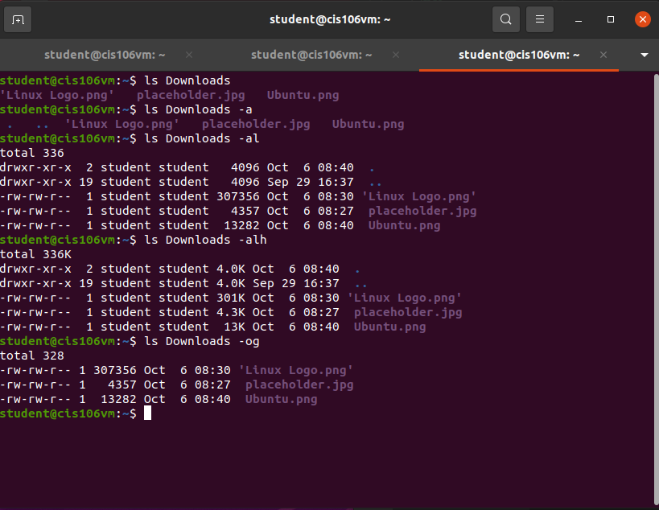
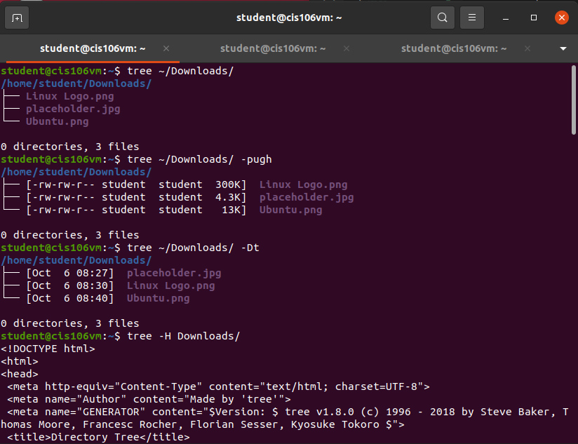
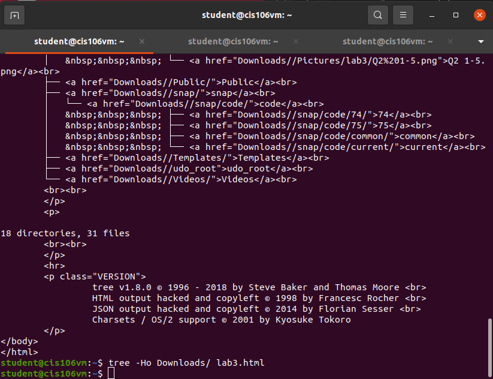
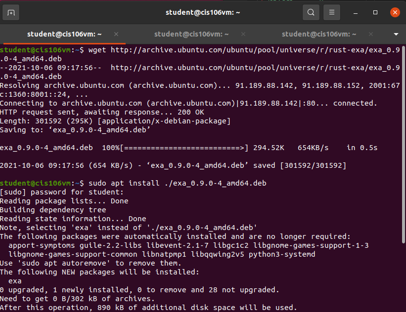
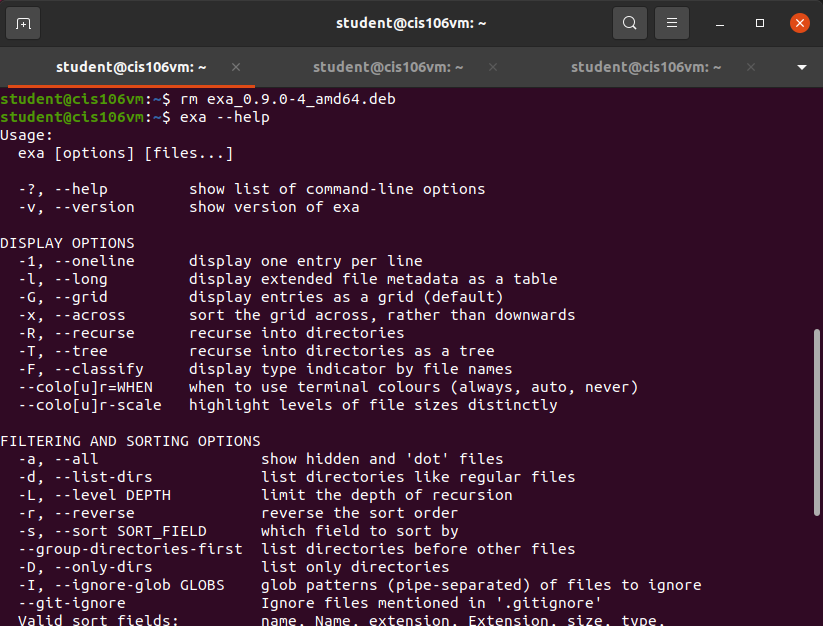
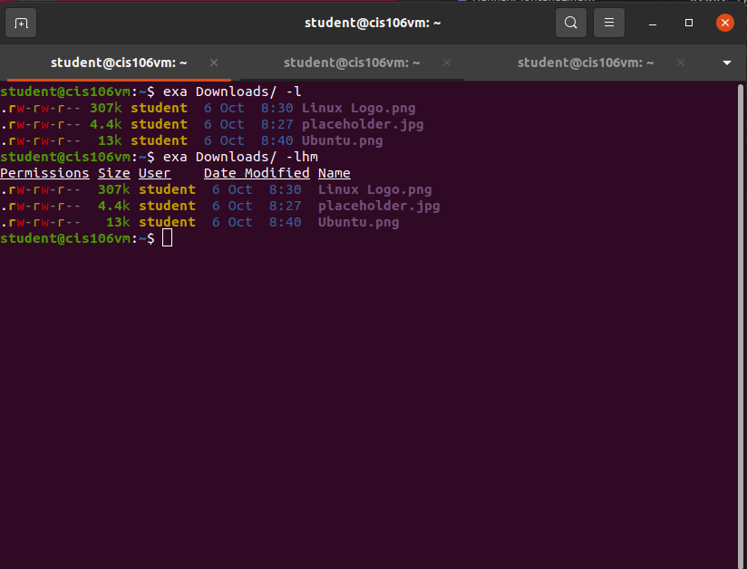
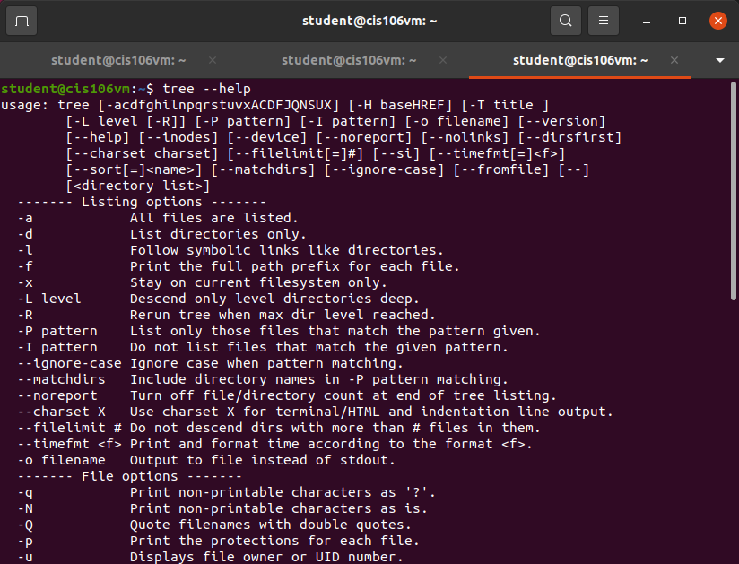
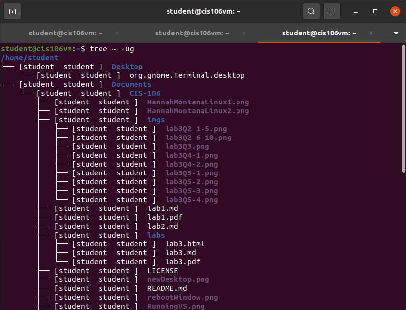
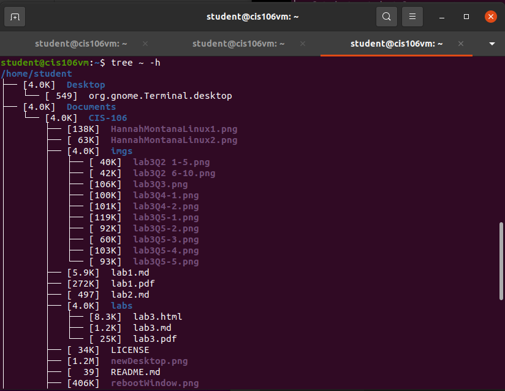

# Lab 3 | Installing software and navigating the file system | Answers
Assignment description [here](https://raw.githubusercontent.com/ra559/cis106/main/labs/lab3.md)

## Question 1
1. Which command did you use to search for the themes and to install them?
   apt search theme

   sudo apt install yuyu-gtk-theme

2. Which commands did you use to find and install the web browser?
   apt search browser
   sudo apt install brave-browser

3. 3.1. What is the name of the package?
    brave-browser

    3.2. What dependencies are needed in order to install the package? (you can either take a screenshot of the terminal or copy and paste from the terminal)
    
    The following additional packages will be installed:
    brave-keyring
    The following NEW packages will be installed:
    brave-browser brave-keyring
    3.3. How much disk space will the package utilize after installation?
    291 MB of disk space will be used by the package.

## Question 2

## Question 3

## Question 4

## Question 5

