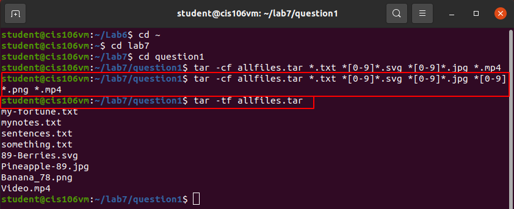

# Lab 5 | Handling Text Files | Answers
Assignment description [here](https://github.com/ra559/cis106/blob/main/labs/lab5.md)

## Question 1

## Question 2

## Question 3

All the tools kept the same 4.0kb of data.

## Question 4

