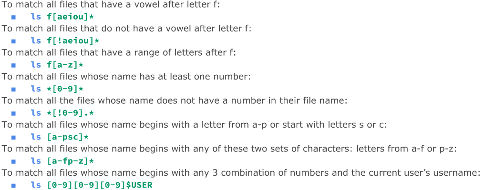

# Introduction to Linux
## What is Linux
* Linux is a kernel
* Core of an OS

## Linux Distribution
* Linux Distro. - complete linux package
* Main two is Debian and Redhat

## Linux Architecture
* Kernel - core of the OS
* Daemons - programs in the background
* Shells - interface
* GDE - graphical desktop environment for the user
* Linux File system
  * Hierarchical Treelike struct.
  * Highest point if the root (/)

## Software Licensing Agreement
* Open Source - for free to use
* Closed Source - not distributed code
    * Freeware - free but no open source
    * Shareware - free on a trial
* Free software - can be free of charge or obtained by a fee and distributed with the source code.

## Ubuntu
* Ubuntu is a Linux distro that is free distro

## Debian
* Debian is all-volunteer org. for free software.

## GNU/Linux
* Linux is modelled on the Unix OS
* Free/Open Source made by the people

# Installing Ubuntu/Virtualization/Raspberry Pi

## Virtualization
* Two Types
  * Server-side
    * Thick client or Fat client
    * Thin client
    * Zero Client
    * Runs on hardware
  * Client-side
    * Manage virtual machine
    * Runs on Host OS
      * VirtualBox,etc

## VirtualBox
* Powerful type 2 virtualization product
* Open Source
  
## VMWare Workstation Player
* Free also but less features

## Min/Req Requirements
* AMD 5 or Intel 5 processor
* Dual Core 1.3GHz or faster
* 4GB RAM
* Enough Storage for task

## VirtualBox Extension Pack
* Base Package - all open source components
* Extension Package - Extends funct. of VM base package.

## VirtualBox Settings
Drag n Drop - Bidirectional
Shared Clipboard - bidirectional
Enable Disk Encryption

## Creating Virtual OS
Name: Indicate OS and Purpose
Machine Folder: Location of host machine
Type: Linux
Version: Ubuntu 64-bit
Memory Size: 2048mb
VDI Type
50gb Recommended
Optical then Hard Disk Boot Order
2 CPU cores
100% Execution Cap.
128mb of Video Memory
Enable 3d Acceleration
Add Optical Drive Ubuntu iso in controller IDE

## What is Raspberry Pi
* Low Cost computer
* Need Pi, Power Supply, Memory, Input, and Display.
* Raspberry Pi Imager used to install OS.# Desktop Environments
* GUI - Graphical User Interface
* DE - Desktop Environment
* Most common are GNOME and KDE
* Contents
  * Display Manager
  * File Manager
  * Icons (Programs)
  * Launcher
  * Menus
  * System Tray
  * Widgets
  * Window Manager

## Gnome
* Default for Ubuntu and other distros.
* GNU Network Object Model Environment
* Free Software project to develop a desktop environment and applications for it.

## KDE
* Kool Desktop environment

## The Bash Shell
* Unix shell and command language software.
* CLI - command-line interface
  * Terminal Emulator
  * Linux Console

# Managing Software
* Package - archives that contain software.

## Debian Package Management System
* DPMS to manage software on all Debian distros.
* .deb extension
* dpkg (Debian package) applications

## Advanted Package Tool
* APT - tool for managing debian packages
* sudo - requires privileges as root user
* install - install specified package
* remove - remove specified package
* ex. sudo apt install firefox flameshot caffeine -y
* ex. sudo apt purge firefox+ flameshot- caffeine- vlc+
* Search programs
  * apt search "web"
  * --help for more

## Installing .deb files
* Get the file
  * sudo dkpg -i google-chrome-stable.deb

* gdebi - simple tool to install deb files
  * sudo gdebi google-chrome-stable.deb

## Snaps and Flatpak
* Snaps - packages of apps
  * Snap Store - app store

* Flatpak - nextgen packaging software for linux.

# Linux Directory Structure
* Branch based

## Pwd Command
* Display current working directory
  * pwd

## Cd Command
* Change current working directory
  * cd + destination
    * Home Directory
      * cd
      * cd ~
      * cd $HOME
  * Previous Directory
    * cd -
  * Go Back 1 Directory
    * cd ../

## Ls command
* List content in a directory
* man ls for options
* ls
  * List hidden too
    * ls -a
  * List files inside a directory
    * ls -a ~/Pictures
  * Long List recursively
    * ls -lR ~/Pictures

## Absolute vs Relative Path
* Absolute starts are root
  * /home/user/Downloads/song.mp3
* Relative starts anywhere relative to working directory
  * pwd is /home/user
    * /Downloads/song.mp3

# Managing Files and Directories
* command -option argument
  * ls -l ~/Downloads

## Mkdir
* Create single or multiple directories
* mkdir wallpapers
  * With space
    * mkdir wallpapers/new\ cars
    * mkdir wallpapers/'cities usa'
  * Multiple
    * mkdir wallpapers/{new,old}
  * Create parent same time
    * mkdir -p wallpapers_others/movies

## Touch
* Create files
  * touch list
  * touch ~/Downloads/games.txt

## Rm
* Remove Files
  * rm
    * Remove Directory
      * rm -r
    * Empty Directories
      * rmdir command
    * Non-empty directories
      * rm -r + directory

## Mv
* Move or rename directories/files
  * mv + source + destination
  * Can rename
    * mv + file/directory to rename + new name
  * Move Multiple directories/files
    * mv games/ wallpapers/ rockmusic/
  
## Cp
* Copies files/directories
  * cp + files to copy + destination
  * Copy directories
    * cp -r 

## Inodes
* Data structure that contains info about file except file name and its contents.
* stat script.sh
  
## Hard Links
* Point to data on hard drive
* Create hard link
  * ln file ~/Downloads/fileHL
  
## Soft Links
* Point to other files instead of data in the hard drive.
* Modify soft link, target file is modified too.
* ln -s file fileSL

## Help Command
* man ls
* q to exit

## Wildcard
* "*" match anything in place of it.
* ? precisely one character
  

## Brace Expansion
  

  # Handling Text
## Cat
* Concatenate file
* cat + file + file2
  * Add Numbers
    * cat -n

## Tac
* Cat but reverse
  
## More
* Pager program for displaying one page at a time. Loads all pages
* more + file
* 10 lines at a time
  * more -10 /var/log/syslog

## Less
* Pager pogram to display one at a time.

## Head
* Displays top N number of lines of file.
* head + option + file
* head -5 /etc/passwd

## Tail
* Same as Head but the tail.
* tail -5 /etc/passwd

## Cut
* cut specific section of each line of a file
* cut + option + file
* First field of each line using tab as field separator.
  * cut -f1 hostnames.txt
* : as field separator
  * cut -d: -f1 /etc/passwd

## Paste
* Merge to join files horizontally in columns
* paste users.txt ips.txt

## Sort
* Sorts file
  * Reverse
    * sort -r
  * Column Number
    * sort -k 2 users.txt*
  * Remove duplicate
    * sort -u users.txt

## Wc
* Print the number of lines,characters,bytes of a file
* wc + option + file
* Bytes
  * wc -c users.txt
* Lines
  * wc -l users.txt

## Tr
* Translate character to another
* Output | tr + option + set +set
  
## Diff
* Display difference between files
* diff + option + file1 + file2

## Grep
* Match string pattern from a file or standard output when using the pipe.
  

## Rev
* Reversing characters position in a given text.
* rev + file

# I/O Redirection
* File descriptor - positive integers used for identifying open files in a given session
  

  

## Pipe
* Used to redirect output to another command
* command 1 | command 2

## Alias
* Create short command for a long command
* alias name_of_alias="command here"
* ex. alias="git add ."
* # Vim
* Command-Line text editor
* sudo apt install vim
* To quit, type:
  * :qa!
  * : - prefix for entering command line mode
  * q - quit
  * a - short for all buffers
  * ! - force
  * set number : set line numbers
* Insert Mode: writing text
* Normal mode: manipulate text
* Command mode: vim commands
* Visual mode: navigation/manipulation of text selections
* Select mode: similar to visual mode
* Ex-mode: command line mode but for batch processing

## Insert Text:
* Create file
  * vim notes.txt
* Use arrow keys to move
* Enter for next line
* Backspace for delete
* Ex.
  * Start Vim
    * vim
  * Enter insert mode
    * Press letter i
    * Type Text Here
  * Enter normal mode
    * Press esc key
  * Quit vim
    * Type :q!

* Saving
  * :w will save the file
  * :w new.txt will save file as new.txt
  * :wq will save the file and quit
  * :wqa! will save the file and close all files open in the buffer.

* Editing
  * :E new.txt will open new.txt and allow you to edit
* Ctrl + g will show the file you are currently editing in the status line.

* Navigating in normal mode
  * H = left
  * J = down
  * K = up
  * L = right

* Search words in vim
  * /hello to search forward for word
  * ?hello to search backward for word
  * * will search for the next occurrence under the cursor
  * "#" will search backward for the previous occurence of the worder under the cursor.

* Delete, copy, paste
* dw = delete current word
* u = undo
* yy = copies a whole line
* x = for cut
* yp = copy the current word
* p = paste after cursor
* P = paste before the cursor

# Managing Data
* Backup : copies files and directories to an archive.
* System backup : restore data in case of system failure
* Archive : file containing many files
* Important directories
  * /etc
  * /home
  * /opt
  * /root
  * /var

## Archive Utilies
### Tar
* Create archive
  * tar + option + archive name + files
* Extract archive
  * tar + options + file to extract

* -f is always required
* -v to display details, recommended

### CPIO
* Create archive
  * ls | cpio -ov > archive.cpio
* Extract archive
  * cpio -iv < archive.cpio
* Archive specific files
  * find . -iname *.sh | cpio -ov > scriptsArchive.cpio
* Create tar archive with cpio
  * ls | cpio - ov -H tar -F sample.tar

### AR
* Create archive
  * ar r test.a *.txt
* List content of archive
  * ar t test.a
* Add new member
  * ar r test.a test3.txt
* Delete member
  * ar d test.a test3.txt

## File Compression
* Gzip, bzip2 and xz commands are for compression

* gunzip = gzip -d
* bunzip = bzip2 -d
* unxz = xz -d
* To decompress in different directory
  * Utility -options < path of compressed file > file with the same new without extension
    * gzip -dkc < ~/compresssed.iso.gzip > ~/Downloads/compressed.iso

# Linux File Permissions
* Ownership
* ls -l to show owner and group owner
* /etc/passwd for list of users
* /etc/group for list of groups
* Change group owner
  * chown
    * ex.
      * chown john file.txt
      * chown :marketinGroup file.txt
      * chown john:marketinGroup file.txt
* rwx rwx rwx
  * file owner, group, other
* Files
  * Read - give permission to view
  * Write - give permission to open and edit file content
  * Execute (x) - Allow user to run file
* Directories
  * Read - List directory's content
  * Write - Add and remove files in subdirectories
  * Execute (x) - Allow to switch directory with cd command

* Hyphen (-) represents permission not granted.
  * ex. r-- means only read permission

## Chmod
* Symbolic Notation
  
  

Cheat sheet:
 
 # Managing User Accounts
* Involves adding, modifying, and deleting user accounts and info.
* To add user accounts
  * user add or adduser command
    * In Ubuntu, adduser is recommended over useradd due to useradd being a low-level-utility
* To modify user's info
  * Use usermod program
* To delete a user
  * userdel program
* Files involved with user creation process:
  * /etc/login.defs
  * /etc/default/useradd
  * /etc/skel/
  * /etc/passwd
  * /etc/shadow
  * /etc/group
* Add user in Ubuntu
  * Run adduser followed by the username.
  * superuser privileges required
  * Will be asked to choose a password.
  * During process, add other details about the user, Optional, can be modified in the future.
* Delete a user in Ubuntu
  * userdel command followed by the user
  * Does not delete user's home directory
  * Pass -r option for the command to delete the home directory.
  * Sudo required

## Purpose of the User Account Files
* /etc/login.defs file
  * Contains directives for use in various shadow password suite commands.
  * Shadow password suite is an umbrella term for commands dealing with account credentials such as useradd, userdel, and passwd.
  * Controls password length, whether it has a home directory, to when the user was created.
  * How to view without any comments
    * grep -ve ^$ /etc/login.defs | grep -v ^#
      * Suppress all comments which line start with # symbol
  * Important Directives:
    * UID - User ID Number to identify user accounts
    * User Account - normal account authorized by a human grant access to the system
    * UID_MIN / UID_MAX indicates lowest/highest UID allowed for user accounts.
  * System Accounts - provide service daemons or perform special task, such as the root user account.
  * SYS_UID_MIN and SYS_UID_MAX - sets min/max UID for system account.
  * See UID of all users in /etc/passwd
    * cut -d 'd' -f 1,3 /etc/passwd
    * awk -F : '{print $1,$3}' /etc/passwd
  * PASS_MAX_DAYS - number of days for password change required.
  * PASS_MIN_DAYS - number of days after password is changed until the password may be changed again.
  * PASS_MIN_LENGTH - min password length
  * PASS_WARN_AGE - number of days a warning is issued to the user prior to password expiration.
  * CREATE_HOME - Default is no, Yes will make home directory
  * ENCRYPT_METHOD - used to hash account passwords.

  * /etc/default/useradd file
    * system default config. for creating new users with the useradd utility
    * view default parameters
      * useradd -D
      * cat /etc/default/useradd
    * Useradd utility won't have home directory unless given the option -m.
    * View all directives
      * cat /etc/default/useradd
      * grep -ve ^$ /etc/default/useradd | grep -v ^#
        * HOME - base directory
        * INACTIVE - number of days till account deactivates
        * SHELL - user account default shell program
        * /etc/skel/ directory
          * stores files that are copied to each user's home directory.
  *  /etc/passwd file
     *  info about every account
     *  7 fields divided by a :
     *  Fields
        *  1 - username
        *  2 - password field/ No longer used to store passwords. Indicated by x
        *  3 - UID
        *  4 - GID
        *  5 - Comment field optional
        *  6 - Home Directory
        *  7 - Default shell. If set to /sbin/nologin or /bin/false, can't log in.
           *  /bin/false will kick out from system when trying to log in
           *  /sbin/nologin shell tries to log in, message will display that user is kicked out.
           *  Message displayed by the /sbin/nologin is stored in /etc/nologin.txt

  * /etc/shadow file
    * contains user's passwords.
    * 
    * Unix Epoch Time - point in time for Unix

  * Creating a user with useradd
    * useradd is a low-level utility
      * -md are options needed for adding a home directory to the new user.
      * /home/student is a new user's home directory
      * -s specifying user login shell
      * /bin/bash the new user's login shell
      * student the user's username
  * Viewing user's account info
    * grep student/etc/passwd
    * sudo grep student /etc/shadow
    * ls -A /home/student/
    * sudo ls -A /etc/skel/
  * getent utility - used to view user's account and password.
    * getent passwd student

* Maintaing Passwords
  * useradd does not create passwords for users
    * passwd utility is used for that.
  * Change password for another user:
    * passwd + username
  * For current user
    * passwd with no arguments
  * Passwd utility can also lock and unlock accounts with -l and -u options.
  * 
  * Another password is chage
    * Modifying password information
    * Display password information

* Modifying User Accounts
  * Example
    * sudo useradd sampleuser
    * Give home directory
      * sudo usermod -md /home/sampleuser sampleuser
    * Give user a password
      * sudo passwd sampleuser
    * Login with the new user
      * su sampleuser
    * Change default loginshell
      * Log out: exit
      * Change default shell: sudo usermod -s /bin/bash sampleuser
  
*  Deleteing User Accounts
   *  userdel utility -r switch
   *  sudo userdel -r sampleuser
   *  Make sure to check company policies
  
# Managing Groups
* Groups organizational structure is part of DAC, discretionary access control.
* User given membership to particular group called account's default group.
* GID to identify Groups
* groupadd utility to add group to user
* -G command to override default behavior
* addgroup used instead since groupadd is a low-level utility.
* /etc/gshadow file is where group passwords are stored
* groupmod command for modifying particular groups.