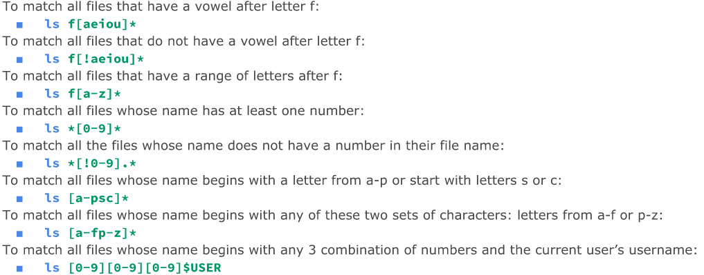
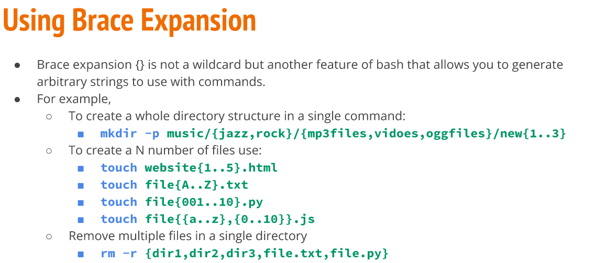

# Managing Files and Directories
* command -option argument
  * ls -l ~/Downloads

## Mkdir
* Create single or multiple directories
* mkdir wallpapers
  * With space
    * mkdir wallpapers/new\ cars
    * mkdir wallpapers/'cities usa'
  * Multiple
    * mkdir wallpapers/{new,old}
  * Create parent same time
    * mkdir -p wallpapers_others/movies

## Touch
* Create files
  * touch list
  * touch ~/Downloads/games.txt

## Rm
* Remove Files
  * rm
    * Remove Directory
      * rm -r
    * Empty Directories
      * rmdir command
    * Non-empty directories
      * rm -r + directory

## Mv
* Move or rename directories/files
  * mv + source + destination
  * Can rename
    * mv + file/directory to rename + new name
  * Move Multiple directories/files
    * mv games/ wallpapers/ rockmusic/
  
## Cp
* Copies files/directories
  * cp + files to copy + destination
  * Copy directories
    * cp -r 

## Inodes
* Data structure that contains info about file except file name and its contents.
* stat script.sh
  
## Hard Links
* Point to data on hard drive
* Create hard link
  * ln file ~/Downloads/fileHL
  
## Soft Links
* Point to other files instead of data in the hard drive.
* Modify soft link, target file is modified too.
* ln -s file fileSL

## Help Command
* man ls
* q to exit

## Wildcard
* "*" match anything in place of it.
* ? precisely one character
  

## Brace Expansion
  

  