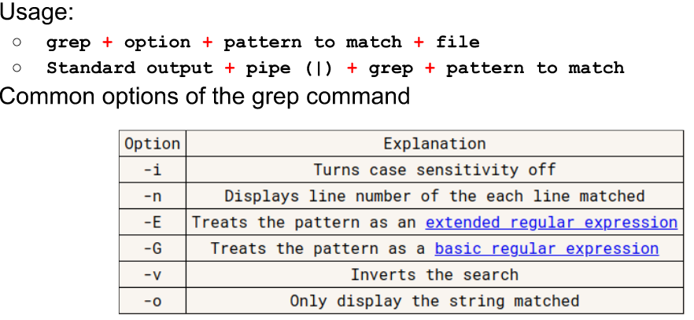
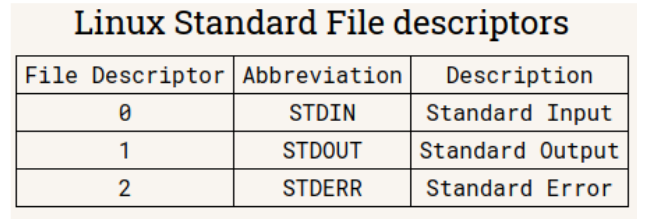
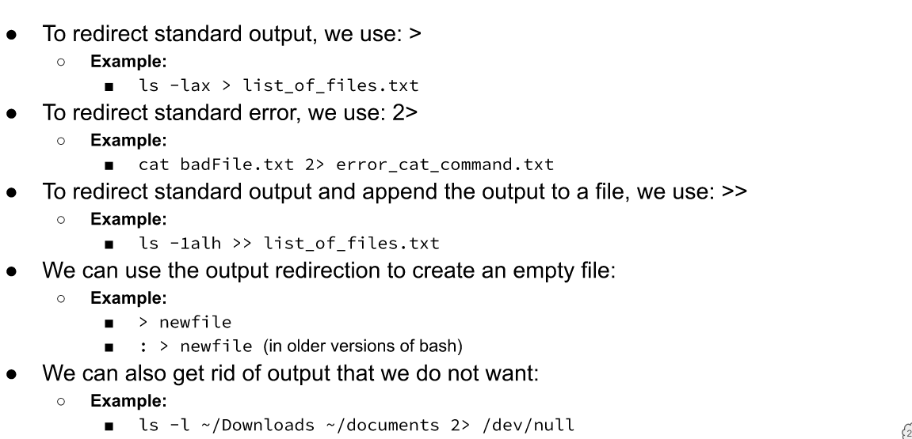

# Handling Text
## Cat
* Concatenate file
* cat + file + file2
  * Add Numbers
    * cat -n

## Tac
* Cat but reverse
  
## More
* Pager program for displaying one page at a time. Loads all pages
* more + file
* 10 lines at a time
  * more -10 /var/log/syslog

## Less
* Pager pogram to display one at a time.

## Head
* Displays top N number of lines of file.
* head + option + file
* head -5 /etc/passwd

## Tail
* Same as Head but the tail.
* tail -5 /etc/passwd

## Cut
* cut specific section of each line of a file
* cut + option + file
* First field of each line using tab as field separator.
  * cut -f1 hostnames.txt
* : as field separator
  * cut -d: -f1 /etc/passwd

## Paste
* Merge to join files horizontally in columns
* paste users.txt ips.txt

## Sort
* Sorts file
  * Reverse
    * sort -r
  * Column Number
    * sort -k 2 users.txt*
  * Remove duplicate
    * sort -u users.txt

## Wc
* Print the number of lines,characters,bytes of a file
* wc + option + file
* Bytes
  * wc -c users.txt
* Lines
  * wc -l users.txt

## Tr
* Translate character to another
* Output | tr + option + set +set
  
## Diff
* Display difference between files
* diff + option + file1 + file2

## Grep
* Match string pattern from a file or standard output when using the pipe.
  

## Rev
* Reversing characters position in a given text.
* rev + file

# I/O Redirection
* File descriptor - positive integers used for identifying open files in a given session
  

  

## Pipe
* Used to redirect output to another command
* command 1 | command 2

## Alias
* Create short command for a long command
* alias name_of_alias="command here"
* ex. alias="git add ."
* 