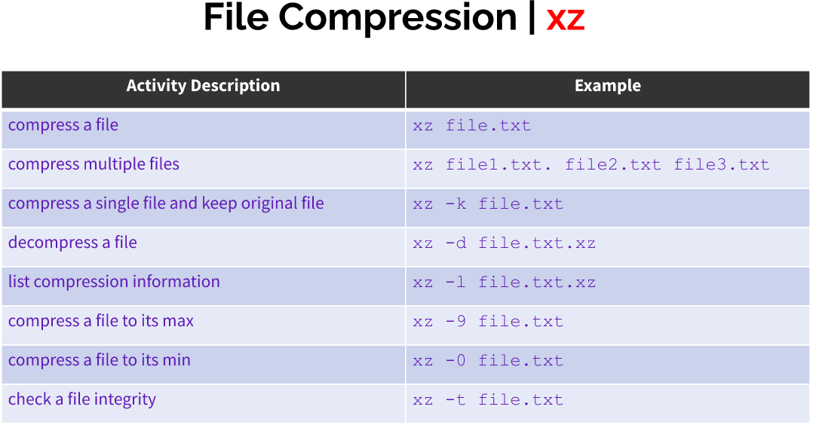
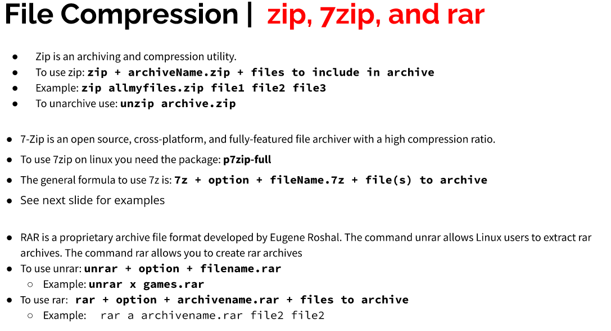
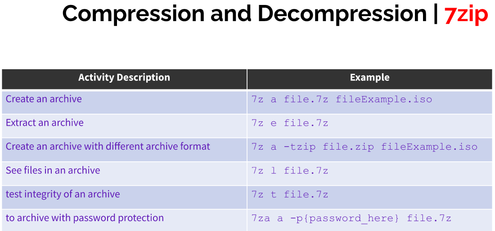

# Vim
* Command-Line text editor
* sudo apt install vim
* To quit, type:
  * :qa!
  * : - prefix for entering command line mode
  * q - quit
  * a - short for all buffers
  * ! - force
  * set number : set line numbers
* Insert Mode: writing text
* Normal mode: manipulate text
* Command mode: vim commands
* Visual mode: navigation/manipulation of text selections
* Select mode: similar to visual mode
* Ex-mode: command line mode but for batch processing

## Insert Text:
* Create file
  * vim notes.txt
* Use arrow keys to move
* Enter for next line
* Backspace for delete
* Ex.
  * Start Vim
    * vim
  * Enter insert mode
    * Press letter i
    * Type Text Here
  * Enter normal mode
    * Press esc key
  * Quit vim
    * Type :q!

* Saving
  * :w will save the file
  * :w new.txt will save file as new.txt
  * :wq will save the file and quit
  * :wqa! will save the file and close all files open in the buffer.

* Editing
  * :E new.txt will open new.txt and allow you to edit
* Ctrl + g will show the file you are currently editing in the status line.

* Navigating in normal mode
  * H = left
  * J = down
  * K = up
  * L = right

* Search words in vim
  * /hello to search forward for word
  * ?hello to search backward for word
  * * will search for the next occurrence under the cursor
  * "#" will search backward for the previous occurence of the worder under the cursor.

* Delete, copy, paste
* dw = delete current word
* u = undo
* yy = copies a whole line
* x = for cut
* yp = copy the current word
* p = paste after cursor
* P = paste before the cursor

# Managing Data
* Backup : copies files and directories to an archive.
* System backup : restore data in case of system failure
* Archive : file containing many files
* Important directories
  * /etc
  * /home
  * /opt
  * /root
  * /var

## Archive Utilies
### Tar
* Create archive
  * tar + option + archive name + files
* Extract archive
  * tar + options + file to extract

* -f is always required
* -v to display details, recommended

### CPIO
* Create archive
  * ls | cpio -ov > archive.cpio
* Extract archive
  * cpio -iv < archive.cpio
* Archive specific files
  * find . -iname *.sh | cpio -ov > scriptsArchive.cpio
* Create tar archive with cpio
  * ls | cpio - ov -H tar -F sample.tar

### AR
* Create archive
  * ar r test.a *.txt
* List content of archive
  * ar t test.a
* Add new member
  * ar r test.a test3.txt
* Delete member
  * ar d test.a test3.txt

## File Compression
* Gzip, bzip2 and xz commands are for compression

* gunzip = gzip -d
* bunzip = bzip2 -d
* unxz = xz -d
* To decompress in different directory
  * Utility -options < path of compressed file > file with the same new without extension
    * gzip -dkc < ~/compresssed.iso.gzip > ~/Downloads/compressed.iso

# Linux File Permissions
* Ownership
* ls -l to show owner and group owner
* /etc/passwd for list of users
* /etc/group for list of groups
* Change group owner
  * chown
    * ex.
      * chown john file.txt
      * chown :marketinGroup file.txt
      * chown john:marketinGroup file.txt
* rwx rwx rwx
  * file owner, group, other
* Files
  * Read - give permission to view
  * Write - give permission to open and edit file content
  * Execute (x) - Allow user to run file
* Directories
  * Read - List directory's content
  * Write - Add and remove files in subdirectories
  * Execute (x) - Allow to switch directory with cd command

* Hyphen (-) represents permission not granted.
  * ex. r-- means only read permission

## Chmod
* Symbolic Notation
  
  

Cheat sheet:
 
 