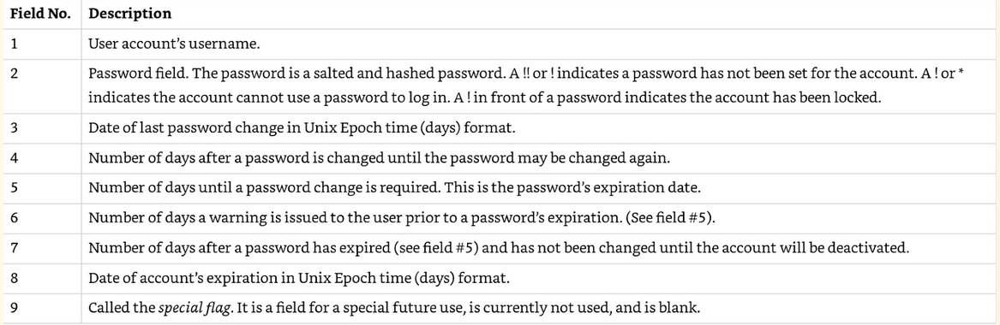
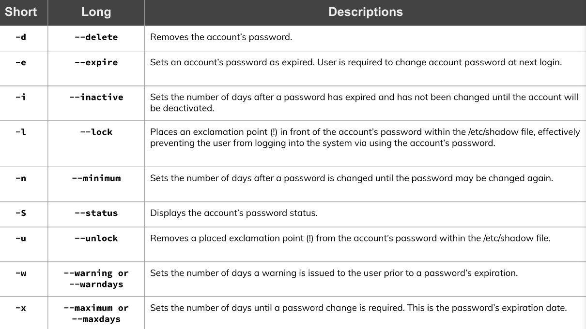

# Managing User Accounts
* Involves adding, modifying, and deleting user accounts and info.
* To add user accounts
  * user add or adduser command
    * In Ubuntu, adduser is recommended over useradd due to useradd being a low-level-utility
* To modify user's info
  * Use usermod program
* To delete a user
  * userdel program
* Files involved with user creation process:
  * /etc/login.defs
  * /etc/default/useradd
  * /etc/skel/
  * /etc/passwd
  * /etc/shadow
  * /etc/group
* Add user in Ubuntu
  * Run adduser followed by the username.
  * superuser privileges required
  * Will be asked to choose a password.
  * During process, add other details about the user, Optional, can be modified in the future.
* Delete a user in Ubuntu
  * userdel command followed by the user
  * Does not delete user's home directory
  * Pass -r option for the command to delete the home directory.
  * Sudo required

## Purpose of the User Account Files
* /etc/login.defs file
  * Contains directives for use in various shadow password suite commands.
  * Shadow password suite is an umbrella term for commands dealing with account credentials such as useradd, userdel, and passwd.
  * Controls password length, whether it has a home directory, to when the user was created.
  * How to view without any comments
    * grep -ve ^$ /etc/login.defs | grep -v ^#
      * Suppress all comments which line start with # symbol
  * Important Directives:
    * UID - User ID Number to identify user accounts
    * User Account - normal account authorized by a human grant access to the system
    * UID_MIN / UID_MAX indicates lowest/highest UID allowed for user accounts.
  * System Accounts - provide service daemons or perform special task, such as the root user account.
  * SYS_UID_MIN and SYS_UID_MAX - sets min/max UID for system account.
  * See UID of all users in /etc/passwd
    * cut -d 'd' -f 1,3 /etc/passwd
    * awk -F : '{print $1,$3}' /etc/passwd
  * PASS_MAX_DAYS - number of days for password change required.
  * PASS_MIN_DAYS - number of days after password is changed until the password may be changed again.
  * PASS_MIN_LENGTH - min password length
  * PASS_WARN_AGE - number of days a warning is issued to the user prior to password expiration.
  * CREATE_HOME - Default is no, Yes will make home directory
  * ENCRYPT_METHOD - used to hash account passwords.

  * /etc/default/useradd file
    * system default config. for creating new users with the useradd utility
    * view default parameters
      * useradd -D
      * cat /etc/default/useradd
    * Useradd utility won't have home directory unless given the option -m.
    * View all directives
      * cat /etc/default/useradd
      * grep -ve ^$ /etc/default/useradd | grep -v ^#
        * HOME - base directory
        * INACTIVE - number of days till account deactivates
        * SHELL - user account default shell program
        * /etc/skel/ directory
          * stores files that are copied to each user's home directory.
  *  /etc/passwd file
     *  info about every account
     *  7 fields divided by a :
     *  Fields
        *  1 - username
        *  2 - password field/ No longer used to store passwords. Indicated by x
        *  3 - UID
        *  4 - GID
        *  5 - Comment field optional
        *  6 - Home Directory
        *  7 - Default shell. If set to /sbin/nologin or /bin/false, can't log in.
           *  /bin/false will kick out from system when trying to log in
           *  /sbin/nologin shell tries to log in, message will display that user is kicked out.
           *  Message displayed by the /sbin/nologin is stored in /etc/nologin.txt

  * /etc/shadow file
    * contains user's passwords.
    * 
    * Unix Epoch Time - point in time for Unix

  * Creating a user with useradd
    * useradd is a low-level utility
      * -md are options needed for adding a home directory to the new user.
      * /home/student is a new user's home directory
      * -s specifying user login shell
      * /bin/bash the new user's login shell
      * student the user's username
  * Viewing user's account info
    * grep student/etc/passwd
    * sudo grep student /etc/shadow
    * ls -A /home/student/
    * sudo ls -A /etc/skel/
  * getent utility - used to view user's account and password.
    * getent passwd student

* Maintaing Passwords
  * useradd does not create passwords for users
    * passwd utility is used for that.
  * Change password for another user:
    * passwd + username
  * For current user
    * passwd with no arguments
  * Passwd utility can also lock and unlock accounts with -l and -u options.
  * 
  * Another password is chage
    * Modifying password information
    * Display password information

* Modifying User Accounts
  * Example
    * sudo useradd sampleuser
    * Give home directory
      * sudo usermod -md /home/sampleuser sampleuser
    * Give user a password
      * sudo passwd sampleuser
    * Login with the new user
      * su sampleuser
    * Change default loginshell
      * Log out: exit
      * Change default shell: sudo usermod -s /bin/bash sampleuser
  
*  Deleteing User Accounts
   *  userdel utility -r switch
   *  sudo userdel -r sampleuser
   *  Make sure to check company policies
  
# Managing Groups
* Groups organizational structure is part of DAC, discretionary access control.
* User given membership to particular group called account's default group.
* GID to identify Groups
* groupadd utility to add group to user
* -G command to override default behavior
* addgroup used instead since groupadd is a low-level utility.
* /etc/gshadow file is where group passwords are stored
* groupmod command for modifying particular groups.